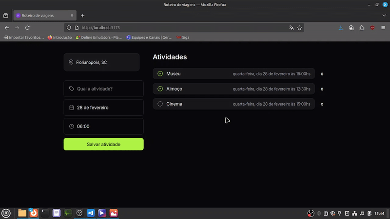

## Site de Roteiro de Viagens
Projeto originalmente criado na 16ª NLW Journey da Rocketseat, que ocorreu do dia 8 a 15 de julho de 2024. Inicialmente o projeto contava apenas com HTML, CSS e JS, mas agora foi refeito com novas tecnologias.

Trata-se de um planejador de viagens, onde é possível registrar atividades (nome, data e status de conclusão).

### Demonstração


## Tecnologias utilizadas:
- React com Typescript
- ASP.NET 8.0
- Entity Framework Core
- Day.js para formatação de datas
- Banco PostgreSQL

### Iniciando o projeto

Obs.: Esses comandos foram usados especificamente no Linux.

Para iniciar o frontend:
```
cd frontend

npm install
npm run dev
```

- Instalando ASP.NET e dependências:
```
sudo apt-get install -y dotnet-sdk-8.0
sudo apt-get install -y aspnetcore-runtime-8.0

cd backend/
dotnet add package Microsoft.EntityFrameworkCore
dotnet add package Microsoft.EntityFrameworkCore.Design
dotnet add package Npgsql.EntityFrameworkCore.PostgreSQL
```

Para criar o banco:
```
cd backend/
dotnet tool install --global dotnet-ef

dotnet ef migrations add CriarTabelas
dotnet ef database update
```

### Comandos para criação do projeto

- Criação do projeto React
```
npm create vite@latest frontend -- --template react-ts
```

- Criando projeto ASP.NET:
```
dotnet new webapp -n backend
```

### Referências
- Postagem: [NLW Journey - Rocket Seat](https://www.rocketseat.com.br/blog/artigos/post/por-que-nlw-e-especial)
